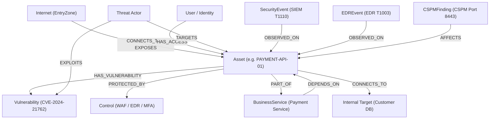

# CYBERVAL P3 — Cyber Risk Digital Twin Architecture & Reference

## Overview
The **Cyber Risk Digital Twin** transforms normalized enterprise security data from PostgreSQL into a connected, analytical directed graph using Python and **NetworkX**. PostgreSQL remains the single source of truth, while NetworkX serves as the in-memory analytical graph engine.

The digital twin answers core security questions:
1. **Connectivity**: What is connected to what across network tiers?
2. **Identity & Access**: Who can access which critical systems?
3. **Vulnerabilities**: Which assets have exploitable vulnerabilities (CVEs)?
4. **Protective Controls**: Which master controls protect or fail to protect assets?
5. **Threats**: Which threat categories and actors target which assets?
6. **Business Dependencies**: Which revenue-generating business services depend on which infrastructure?
7. **Attack Propagation**: How could an adversary pivot through perimeter exposures into internal crown jewels?
8. **Path Prioritization**: Which attack paths present the highest structural risk?

---

## 1. Graph Data Model

The digital twin uses a multi-directed graph (`nx.MultiDiGraph`) supporting heterogeneous node and edge types with rich risk metadata.



---

## 2. Node Types & Metadata

| Node Type | ID Format | Example Label | Key Metadata Attributes |
| :--- | :--- | :--- | :--- |
| **`EntryZone`** | `internet-0` | `Internet` | `category="perimeter"`, `risk_score=100.0`, `internet_exposed=True` |
| **`Asset`** | `asset-{id}` | `PAYMENT-API-01` | `db_id`, `asset_type`, `environment`, `owner`, `internet_exposed`, `business_service`, `criticality`, `risk_score` |
| **`Vulnerability`** | `vuln-{id}` | `CVE-2024-21762` | `db_id`, `cve_id`, `cvss_score`, `severity`, `status`, `title` |
| **`User`** | `user-{id}` | `Bob Smith` | `db_id`, `email`, `role`, `privileged` (bool) |
| **`Control`** | `control-{id}` | `Multi-factor Authentication` | `db_id`, `effectiveness` (0.0-1.0), `status`, `description` |
| **`BusinessService`** | `service-{id}` | `Payment Service` | `db_id`, `owner`, `criticality`, `annual_revenue` |
| **`Threat`** | `threat-{id}` | `Credential Theft` | `db_id`, `category`, `annual_frequency`, `source` |
| **`SecurityEvent`** | `siem-{id}` | `Brute Force Authentication` | `db_id`, `source="siem"`, `severity`, `mitre_technique="T1110"`, `observed_at`, `details` |
| **`EDREvent`** | `edr-{id}` | `Credential Dumping` | `db_id`, `source="edr"`, `severity="critical"`, `mitre_technique="T1003"`, `observed_at`, `details` |
| **`CSPMFinding`** | `cspm-{id}` | `Open Security Group` | `db_id`, `source="cspm"`, `severity="high"`, `observed_at`, `details` |

---

## 3. Edge Relationships

| Edge Relationship | Source Node $\to$ Target Node | Semantic Description | Synthetic Flag |
| :--- | :--- | :--- | :--- |
| **`CONNECTS_TO`** | `EntryZone` / `Asset` $\to$ `Asset` | Network reachability and ingress traffic flow between tiers | Explicit / Architecture topology |
| **`HAS_ACCESS`** | `User` $\to$ `Asset` | User access permissions (SSH, API, Console, Admin) from IAM telemetry | Explicit |
| **`HAS_VULNERABILITY`** | `Asset` $\to$ `Vulnerability` | Asset affected by a specific CVE from vulnerability scanner | Explicit (`asset_id`) |
| **`PROTECTED_BY`** | `Asset` $\to$ `Control` | Control mitigating attack surface on asset type | Synthetic (Heuristic) |
| **`PART_OF`** | `Asset` $\to$ `BusinessService` | Asset powers and belongs to a business service | Explicit (`business_service_id`) |
| **`DEPENDS_ON`** | `BusinessService` $\to$ `Asset` | Service availability directly depends on asset integrity | Explicit |
| **`TARGETS`** | `Threat` $\to$ `Asset` | Threat intelligence actor targeting exposed assets | Synthetic |
| **`EXPLOITS`** | `Threat` $\to$ `Vulnerability` | Threat actor capability exploiting a CVE category | Synthetic |
| **`OBSERVED_ON`** | `SecurityEvent` / `EDREvent` $\to$ `Asset` | Live telemetry alert detected on host | Explicit (`asset_id`) |
| **`AFFECTS`** | `CSPMFinding` $\to$ `Asset` | Cloud misconfiguration identified on asset | Explicit (`asset_id`) |

---

## 4. Attack Path Discovery Algorithm

Attack paths are discovered dynamically using NetworkX path algorithms on the network transition topology.

### Algorithm Mechanics:
1. **Entry Point Identification**: Identifies entry points $S = \{ \text{internet-0} \} \cup \{ a \in \text{Assets} \mid \text{internet\_exposed}(a) = \text{True} \}$.
2. **Target Crown Jewel Identification**: Identifies high-value assets $T = \{ a \in \text{Assets} \mid \text{criticality}(a) = \text{"critical"} \lor \text{asset\_type}(a) = \text{"database"} \}$.
3. **Simple Path Traversal**: Uses `nx.all_simple_paths(G_attack, source=s, target=t, cutoff=5)` to discover non-cyclical traversal paths.
4. **Multi-Source Context Enrichment**:
   - For every node along the path, inspects adjacent vulnerabilities, controls, IAM access, and telemetry events (SIEM, EDR, CSPM).
   - Collects critical vulnerabilities (CVSS $\ge 9.0$), control gaps (MFA disabled, open ingress), and corroborating signals (T1110 brute force, T1003 credential dumping).

---

## 5. Transparent Path Prioritization Scoring

The attack path score is a **0 to 100 normalized structural prioritization score** (distinct from P2 financial EAL).

$$\text{Path Score} = \text{round}\left(\max\left(5.0, \min\left(100.0, S_{\text{Vuln}} + S_{\text{Internet}} + S_{\text{IAM}} + S_{\text{Telemetry}} + S_{\text{Target}} + S_{\text{Reachability}} + S_{\text{Weakness}} - S_{\text{Control}}\right)\right), 1\right)$$

### Scoring Components (Defensible Normalized 0–100 Scale):
- **Vulnerability Severity ($S_{\text{Vuln}}$)**: Up to $+25.0$ (continuous scaling by max CVSS $+ (\max(\text{CVSS})/10.0) \times 18.0$ with multi-exploit chaining bonus up to $+7.0$)
- **Internet Ingress Exposure ($S_{\text{Internet}}$)**: Up to $+15.0$ ($+15.0$ for direct Internet ingress, $+12.0$ for perimeter gateway/VPN, $+3.0$ for internal pivots)
- **Privileged IAM Access ($S_{\text{IAM}}$)**: Up to $+15.0$ ($+15.0$ for privileged admin credentials, $+7.0$ for standard user access)
- **Security Telemetry Signals ($S_{\text{Telemetry}}$)**: Up to $+15.0$ ($\min(15.0, \text{EDR}(+6.0) + \text{CSPM}(+5.0) + \text{SIEM}(+4.0))$)
- **Target Criticality & Business Value ($S_{\text{Target}}$)**: Up to $+15.0$ ($+15.0$ for critical database/core banking, $+11.0$ for high-value portals/storage, $+6.0$ for medium)
- **Path Reachability & Efficiency ($S_{\text{Reachability}}$)**: Up to $+10.0$ ($\max(2.0, (5 - \text{hops}) \times 2.0)$)
- **Path-Specific Weakness & Correlation ($S_{\text{Weakness}}$)**: Up to $+5.0$ ($+5.0$ for specific payment API correlations, unmitigated admin access, or open ports)
- **Control Mitigation Deduction ($S_{\text{Control}}$)**: Up to $-15.0$ (active controls reduce exploitability based on average effectiveness $\overline{\text{Eff}} \times \min(15.0, \text{Count} \times 2.5)$)
- **Score Range**: Naturally bounded within $[5.0, 100.0]$ without artificial saturation.

---

## 6. The PAYMENT-API-01 Multi-Source Convergence

The digital twin models the multi-source correlated scenario for `PAYMENT-API-01`:

```
Asset: PAYMENT-API-01 (Internet Exposed, Payment Service - Critical)
 ├── Vulnerability: CVE-2024-21762 (CVSS 9.8 Critical RCE)
 ├── IAM: Privileged DevOps Admin Access (MFA Disabled)
 ├── SIEM: T1110 Brute Force Authentication (284 failed attempts)
 ├── EDR: T1003 Credential Dumping (mimikatz accessing lsass.exe)
 └── CSPM: Open Security Group Port 8443 (0.0.0.0/0 ingress)
```

**Result**:
- `converged_risk_level`: `"critical"`
- `graph_risk_score`: `94.5`
- Primary attack path: `Internet` $\to$ `PAYMENT-API-01` $\to$ `Customer Database`

---

## 7. Asset Dependency & Blast Radius Analysis

For any asset $A$, `GET /api/assets/{id}/dependencies` calculates:
- **Upstream Dependencies**: Inbound traffic sources, gateways, and identity providers.
- **Downstream Dependencies**: Outbound connected services, databases, and business services.
- **Connected Neighbors**: Immediate topological neighbors.
- **Authorized Users**: Users with direct access permissions.
- **Vulnerabilities**: CVEs residing on the asset.
- **Controls**: Controls protecting the asset.
- **Business Services**: Revenue-generating services impacted if this asset is compromised.
- **Traversing Attack Paths**: Prioritized attack paths containing this asset.

---

## 8. Cytoscape.js Frontend API (`GET /api/graph`)

The endpoint returns data formatted for direct consumption by Cytoscape.js in P6 frontend:

```json
{
  "nodes": [
    {
      "data": {
        "id": "asset-2",
        "label": "PAYMENT-API-01",
        "type": "Asset",
        "category": "asset",
        "db_id": 2,
        "risk_score": 92.0,
        "internet_exposed": true,
        "environment": "production",
        "owner": "Payments",
        "criticality": "critical",
        "business_service": "Payment Service"
      }
    }
  ],
  "edges": [
    {
      "data": {
        "id": "edge-connects-2-3",
        "source": "asset-2",
        "target": "asset-3",
        "relationship": "CONNECTS_TO",
        "label": "CONNECTS_TO",
        "weight": 1.0,
        "is_synthetic": false
      }
    }
  ],
  "summary": {
    "total_nodes": 325,
    "total_edges": 472,
    "node_types": {
      "Asset": 100,
      "User": 35,
      "Vulnerability": 8,
      "Control": 8,
      "BusinessService": 5,
      "Threat": 5,
      "SecurityEvent": 120,
      "EDREvent": 60,
      "CSPMFinding": 35,
      "EntryZone": 1
    },
    "edge_types": {
      "CONNECTS_TO": 140,
      "HAS_ACCESS": 55,
      "HAS_VULNERABILITY": 8,
      "PROTECTED_BY": 80,
      "PART_OF": 100,
      "DEPENDS_ON": 100,
      "OBSERVED_ON": 180,
      "AFFECTS": 35,
      "EXPLOITS": 6
    }
  }
}
```

---

## 9. API Reference

| Method & Path | Description | Query Parameters / Payload |
| :--- | :--- | :--- |
| `GET /api/graph` | Full Cytoscape-compatible digital twin graph | None |
| `GET /api/attack-paths` | Discovered attack paths prioritized by score | `limit` (default: 20), `min_score` (default: 0.0), `target_asset_id` |
| `GET /api/assets/{id}/dependencies` | Asset dependency and blast radius map | None |
| `GET /api/assets/{id}/attack-paths` | Attack paths traversing or targeting asset | None |
| `GET /api/correlation/asset/{id}` | Multi-source telemetry convergence for an asset | Asset ID or Name (e.g. `PAYMENT-API-01`) |
| `GET /health` | Service health status | None |
| `GET /api/assets` | Normalized enterprise assets | None |
| `GET /api/risk/enterprise` | Enterprise financial risk (P1/P2) | None |
| `GET /api/compliance` | Framework control mappings (NIST, ISO, CIS, RBI, SEBI) | None |
